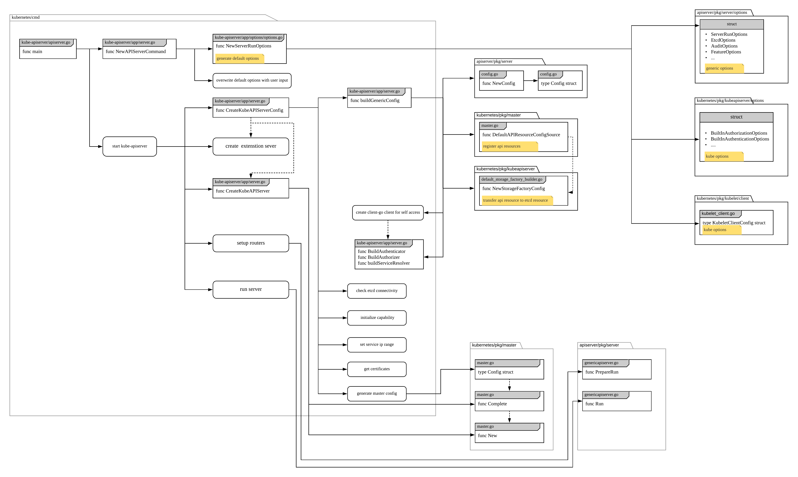

# Table of contents
1. [overview](#overview)
2. [main](#main-function)
3. [generate server command](#generate-server-command)
4. [run apiserver server](#run-kube-apiserver)

# Overview

# Main function
*cmd/kube-apiserver/apiserver.go*

this is the entry of kube-apisever which just simply generates server run command and execute it.

```go
func main() {
	rand.Seed(time.Now().UnixNano())
	
	// generate start command
	command := app.NewAPIServerCommand()
	logs.InitLogs()
	// make sure logs are always recorded even apiserver crash
	defer logs.FlushLogs()

	if err := command.Execute(); err != nil {
		fmt.Fprintf(os.Stderr, "error: %v\n", err)
		os.Exit(1)
	}
}
```
# Generate server command
*cmd/kube-apiserver/app/server.go*
## initialize default server options
```go
// use cobra to generate CLI
func NewAPIServerCommand() *cobra.Command {
   	s := options.NewServerRunOptions()
	cmd := &cobra.Command{
		Use: "kube-apiserver",
		...
		RunE: func(cmd *cobra.Command, args []string) error {
			...
			// set default options
			completedOptions, err := Complete(s)
			...
			// call Run when calling cmd.Execute()
			return Run(completedOptions, genericapiserver.SetupSignalHandler())
		},
	}
	...
```
basically there're three types of options
* genericoptions(*apiserver/pkg/server/options*)	
	
	all kube-apiserver options are defined here. details will be in another charpter
* kubeoptions(*kubernetes/pkg/kubeapiserver/options*)
	
	a wrapper of genericoptions
* KubeletClientConfig(*kubernetes/pkg/kubelet/client/kubelet_client.go*)

```go
func NewServerRunOptions() *ServerRunOptions {
	s := ServerRunOptions{
		GenericServerRunOptions: genericoptions.NewServerRunOptions(),
		Etcd:                    genericoptions.NewEtcdOptions(storagebackend.NewDefaultConfig(kubeoptions.DefaultEtcdPathPrefix, nil)),
		SecureServing:           kubeoptions.NewSecureServingOptions(),
		InsecureServing:         kubeoptions.NewInsecureServingOptions(),
		Audit:                   genericoptions.NewAuditOptions(),
		Features:                genericoptions.NewFeatureOptions(),
		...
		KubeletConfig: kubeletclient.KubeletClientConfig{
			...
			}
	s.ServiceClusterIPRange = kubeoptions.DefaultServiceIPCIDR

	// Overwrite the default for storage data format.
	s.Etcd.DefaultStorageMediaType = "application/vnd.kubernetes.protobuf"

	return &s
}
```
## overwirte with user input
```go

	fs := cmd.Flags()
	namedFlagSets := s.Flags()
	verflag.AddFlags(namedFlagSets.FlagSet("global"))
	globalflag.AddGlobalFlags(namedFlagSets.FlagSet("global"), cmd.Name())
	options.AddCustomGlobalFlags(namedFlagSets.FlagSet("generic"))
	for _, f := range namedFlagSets.FlagSets {
		fs.AddFlagSet(f)
	}
	...
```
# Run kube-apiserver
basically two steps here, create config and generate apiserver with that config.

```go
// Run starts apiserver and takes a channel as parameter,
// it will stop apiserver when reciving stop signal.
func Run(completeOptions completedServerRunOptions, stopCh <-chan struct{}) error {
   ...
	server, err := CreateServerChain(completeOptions, stopCh)
	...
	return server.PrepareRun().Run(stopCh)
}

// it creates a GenericAPIServer object which is defined in
// k8s.io/apiserver/pkg/server/genericapiserver.go.
// GenericAPIServer represents a running apiserver which contains state. 
func CreateServerChain(completedOptions completedServerRunOptions, stopCh <-chan struct{}) (*genericapiserver.GenericAPIServer, error) {
	...
	// generate apiserver configuration
	kubeAPIServerConfig, insecureServingInfo, serviceResolver, pluginInitializer, admissionPostStartHook, err := CreateKubeAPIServerConfig(completedOptions, nodeTunneler, proxyTransport)
	
	// create master object(pkg/master/master.go) which represents the kube-apiserver.
	kubeAPIServer, err := CreateKubeAPIServer(kubeAPIServerConfig, apiExtensionsServer.GenericAPIServer, admissionPostStartHook)
	...
	return aggregatorServer.GenericAPIServer, nil
}
```

## create Kube-apiserver config
* generate generic apiserver config
* set api resource config 
* set stoarge config
* check etcd connetivity
* etc.

evntually it will create a master api config

```go
func CreateKubeAPIServerConfig(
	s completedServerRunOptions,
	nodeTunneler tunneler.Tunneler,
	proxyTransport *http.Transport,
) (
	config *master.Config,
	insecureServingInfo *genericapiserver.DeprecatedInsecureServingInfo,
	serviceResolver aggregatorapiserver.ServiceResolver,
	pluginInitializers []admission.PluginInitializer,
	admissionPostStartHook genericapiserver.PostStartHookFunc,
	lastErr error,
) {
	...
	/*
		genericConfig: apiserver configuration including requestTimeout, maxBodySize, authenticator and authorizator .etc ,
			defined in k8s.io/apiserver/pkg/server/config.go.
		versionedInformers: client go informer with 10 mins sync duration.
		insecureServingInfo: http server info.
		serviceResolver: a interface to create service url,
			defined in k8s.io/apiserver/pkg/util/webhook/serviceresolver.go
		pluginInitializers, admissionPostStartHook: to enable default admission plugin.
		storageFactory: storage configuration including etcd options.
	*/
	genericConfig, versionedInformers, insecureServingInfo, serviceResolver, pluginInitializers, admissionPostStartHook, storageFactory, lastErr = buildGenericConfig(s.ServerRunOptions, proxyTransport)
	...
	
	// check etcd connectivity
	if _, port, err := net.SplitHostPort(s.Etcd.StorageConfig.Transport.ServerList[0]); err == nil && port != "0" && len(port) != 0 {
		if err := utilwait.PollImmediate(etcdRetryInterval, etcdRetryLimit*etcdRetryInterval, preflight.EtcdConnection{ServerList: s.Etcd.StorageConfig.Transport.ServerList}.CheckEtcdServers); err != nil {
			lastErr = fmt.Errorf("error waiting for etcd connection: %v", err)
			return
		}
	}
	
	// get service ip range, certificate information from server options
	...
	
	config = &master.Config{
		GenericConfig: genericConfig,
		ExtraConfig: master.ExtraConfig{
			...
		},
	}
	return
}

```
## create kube-apiserver
it simply call master complete and new function to generate a mster object which represents a kube-apiserver.

```go
func CreateKubeAPIServer(kubeAPIServerConfig *master.Config, delegateAPIServer genericapiserver.DelegationTarget, admissionPostStartHook genericapiserver.PostStartHookFunc) (*master.Master, error) {
	kubeAPIServer, err := kubeAPIServerConfig.Complete().New(delegateAPIServer)
	if err != nil {
		return nil, err
	}

	kubeAPIServer.GenericAPIServer.AddPostStartHookOrDie("start-kube-apiserver-admission-initializer", admissionPostStartHook)

	return kubeAPIServer, nil
}
```
also generate extension server based on kube-apiserver config if there's any

```go
// If additional API servers are added, they should be gated.
	apiExtensionsConfig, err := createAPIExtensionsConfig(*kubeAPIServerConfig.GenericConfig, kubeAPIServerConfig.ExtraConfig.VersionedInformers, pluginInitializer, completedOptions.ServerRunOptions, completedOptions.MasterCount,
		serviceResolver, webhook.NewDefaultAuthenticationInfoResolverWrapper(proxyTransport, kubeAPIServerConfig.GenericConfig.LoopbackClientConfig))
	if err != nil {
		return nil, err
	}
	apiExtensionsServer, err := createAPIExtensionsServer(apiExtensionsConfig, genericapiserver.NewEmptyDelegate())
	...
```
## start api server
1. call generic apiserver prerun to register api resouce which invokes master setup.
2. call run to start generic apiserver 

```go
func (s *GenericAPIServer) PrepareRun() preparedGenericAPIServer {
	if s.openAPIConfig != nil {
		s.OpenAPIVersionedService, s.StaticOpenAPISpec = routes.OpenAPI{
			Config: s.openAPIConfig,
		}.Install(s.Handler.GoRestfulContainer, s.Handler.NonGoRestfulMux)
	}

	s.installHealthz()

	// Register audit backend preShutdownHook.
	if s.AuditBackend != nil {
		err := s.AddPreShutdownHook("audit-backend", func() error {
			s.AuditBackend.Shutdown()
			return nil
		})
		if err != nil {
			klog.Errorf("Failed to add pre-shutdown hook for audit-backend %s", err)
		}
	}

	return preparedGenericAPIServer{s}
}

// Run spawns the secure http server. It only returns if stopCh is closed
// or the secure port cannot be listened on initially.
func (s preparedGenericAPIServer) Run(stopCh <-chan struct{}) error {
	err := s.NonBlockingRun(stopCh)
	if err != nil {
		return err
	}

	<-stopCh

	err = s.RunPreShutdownHooks()
	if err != nil {
		return err
	}

	// Wait for all requests to finish, which are bounded by the RequestTimeout variable.
	s.HandlerChainWaitGroup.Wait()

	return nil
}
```
